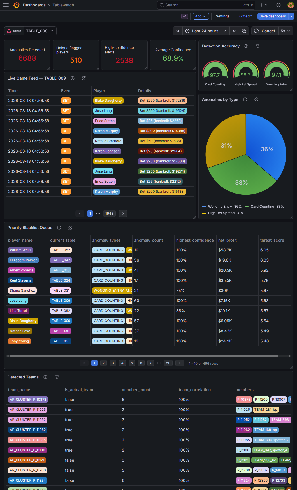
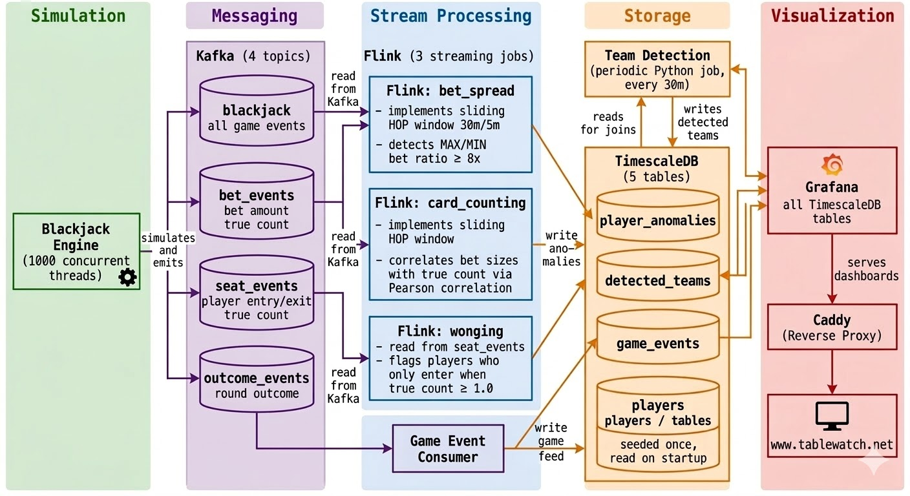

# Tablewatch

A big data, real-time streaming project which performs high throughput fraud / anomaly detection for 1000 simulated blackjack games running concurrently.



## Implementation Details

### Architecture

- **Data source** - Custom blackjack engine designed to emit events as Avro serialized Pydantic classes to Kafka topics.
- **Producers** - Kafka message brokers with 4 topics (blackjack, bet_events, seat_events, outcome_events)
- **Consumers** - 3 Flink streaming jobs for anomaly detection (bet spread, card counting, wonging) plus a periodic team detection job, and 1 Kafka consumer for aggregating game events to DB.
- **Database** - TimescaleDB (Postgres 16) for persisting analytics and game related metadata by consumers.
- **Visualisation** - Grafana for out-of-the-box visualisation widgets that directly reads from Postgres, streaming data with a 5s delay.

### Repository Structure

```
.
├── Caddyfile                          # Caddy reverse proxy config — routes domain to Grafana with auto TLS
├── Dockerfile                         # App image — simulator, consumers, seed
├── Dockerfile.flink                   # Flink image — includes Python deps for pipeline jobs
├── LICENSE
├── Makefile
├── README.md
├── docker-compose.yaml
├── pyproject.toml
├── src
│   ├── blackjack                      # Self-contained blackjack engine (no Kafka dependency)
│   │   ├── bankroll.py                # Session loss/win limit logic
│   │   ├── card.py                    # Card rank/suit definitions
│   │   ├── count.py                   # Hi-Lo card counting implementation
│   │   ├── dealer.py                  # Dealer hand and hit-until-17 logic
│   │   ├── events.py                  # Avro-backed Pydantic event models (BetEvent, SeatEvent, etc.)
│   │   ├── game.py                    # Core game loop — orchestrates rounds and emits events to Kafka
│   │   ├── hand.py                    # Hand value calculation, blackjack and bust detection
│   │   ├── house.py                   # Table rules (splits, surrender, payout ratios)
│   │   ├── player.py                  # Player state (bankroll, hands, quit conditions)
│   │   ├── shoe.py                    # Multi-deck shoe, shuffle penetration
│   │   └── strategy.py                # Betting and action strategy per player role
│   ├── consumers                      # Kafka consumers that write to TimescaleDB
│   │   └── game_event_consumer.py     # Consumes all topics → game_events table for the live feed
│   ├── db                             # Everything database-related
│   │   ├── dashboards                 # Grafana dashboard provisioning
│   │   │   ├── provider.yaml          # Tells Grafana where to load dashboards from
│   │   │   └── tablewatch.json        # Exported Grafana dashboard definition
│   │   ├── datasources.yaml           # Grafana → TimescaleDB connection config
│   │   ├── queries                    # SQL/FQL queries used by Flink jobs and periodic tasks
│   │   │   ├── bet_spread.fql         # Flink: detects high bet spread ratios within sliding windows
│   │   │   ├── card_counting.fql      # Flink: correlates bet sizes with true count to detect counters
│   │   │   ├── load_active_player_tables.sql  # Startup: loads table configs from DB into simulator
│   │   │   ├── load_active_players.sql        # Startup: loads player roster from DB into simulator
│   │   │   ├── team_detection.sql     # Periodic: clusters co-occurring anomaly players into teams
│   │   │   └── wonging.fql            # Flink: flags players who enter tables only at high true counts
│   │   ├── schema.sql                 # TimescaleDB schema — tables, hypertables, indexes
│   │   └── seed.py                    # Seeds tables and players into DB on first startup
│   ├── main.py                        # Entry point — loads fixtures, spawns 1000 concurrent game threads
│   ├── pipelines                      # Flink streaming job definitions
│   │   ├── bet_spread.py              # Flink job: bet spread anomaly detection
│   │   ├── card_counting.py           # Flink job: card counting anomaly detection
│   │   ├── constants.py               # Shared Kafka/Postgres connection config for Flink
│   │   ├── stream.py                  # Base class: Flink env setup, source/sink table helpers
│   │   ├── team_detection.py          # Periodic job: queries DB to resolve player clusters into teams
│   │   └── wonging.py                 # Flink job: wonging entry anomaly detection
│   ├── producers                      # Kafka producers
│   │   └── blackjack_producer.py      # Avro-serialises and publishes game events to Kafka topics
```

### High-level Overview



## Key SQL queries and algorithms

### Card Counting

Card counters size their bets proportionally to the true count, betting large when the count is favourable and small when it is not. This produces a strong positive linear relationship between `bet_amount` and `true_count` that casual players, who bet randomly, do not exhibit.

The detection algorithm computes the **Pearson correlation coefficient** between `bet_amount` and `true_count` for each player within a sliding 30-minute window. A correlation above 0.5 flags the player as a suspected counter. Confidence is normalised linearly from the detection threshold (0.5 → 0%) to a strong signal ceiling (0.8 → 100%).

- Shuffle rounds are excluded as the count resets to zero at each shuffle, which would distort the correlation
- A minimum of 20 hands is required per window to ensure statistical significance
- `table_id` is included in the `GROUP BY` to prevent cross-table contamination when a player moves between tables within the same window

[card_counting.fql](src/db/queries/card_counting.fql)

```sql
INSERT INTO
  player_anomalies WITH CountCorrelation AS (
    SELECT
      player_id,
      window_end,
      -- Pearson correlation: cov(bet, count) / (stddev(bet) * stddev(count))
      -- Expanded inline since Flink SQL lacks a native CORR() aggregate
      (AVG(CAST(bet_amount AS DOUBLE) * CAST(true_count AS DOUBLE))
        - AVG(CAST(bet_amount AS DOUBLE)) * AVG(CAST(true_count AS DOUBLE)))
        / NULLIF(SQRT(
            -- variance of bet_amount
            (AVG(CAST(bet_amount AS DOUBLE) * CAST(bet_amount AS DOUBLE)) - AVG(CAST(bet_amount AS DOUBLE)) * AVG(CAST(bet_amount AS DOUBLE)))
            -- variance of true_count
            * (AVG(CAST(true_count AS DOUBLE) * CAST(true_count AS DOUBLE)) - AVG(CAST(true_count AS DOUBLE)) * AVG(CAST(true_count AS DOUBLE)))
        ), 0) AS count_corr,
      COUNT(*) AS hand_count
    FROM
      TABLE(
        -- Sliding HOP window: 30-min window advancing every 5 min
        HOP(
          TABLE bet_events,
          DESCRIPTOR(event_time),
          INTERVAL '5' MINUTES,   -- slide interval
          INTERVAL '30' MINUTES   -- window size
        )
      )
    WHERE
      is_shuffle = FALSE  -- exclude shuffle rounds; true_count resets to 0 at each shuffle
    GROUP
      BY player_id,
      table_id,           -- grouped per table to prevent cross-table contamination
      window_start,
      window_end
    HAVING
      COUNT(*) >= 20      -- minimum 20 hands for statistical significance
  )
SELECT
  player_id,
  'CARD_COUNTING' AS anomaly_type,
  -- Confidence normalised from threshold (0.5 → 0%) to strong signal (0.8 → 100%)
  LEAST((count_corr - 0.5) / 0.3, 1.0) AS anomaly_confidence,
  window_end AS anomaly_detected_at,
  count_corr
FROM
  CountCorrelation
WHERE
  count_corr > 0.5;  -- detection threshold: moderate-to-strong positive correlation
```

### Bet Spread

Card counters raise their bets significantly when the count is favourable and drop back to the table minimum when it is not. This produces a large ratio between their maximum and minimum bets within a session AKA the bet spread. A casual player betting randomly will have a much lower spread.

The detection algorithm computes `MAX(bet) / MIN(bet)` per player per table within a sliding 30-minute window. A spread of 8x or greater (e.g. betting $25 at a bad count and $200 at a good one) triggers the anomaly. Confidence scales linearly up to a 20x spread.

- Shuffle rounds are excluded as post-shuffle bets often reset to minimum regardless of player type, which would suppress the true spread
- `table_id` is included in the `GROUP BY` to prevent false inflation from a player visiting tables with different minimums (e.g. a $25 table and a $500 table would produce an artificial 20x spread)

[bet_spread.fql](src/db/queries/bet_spread.fql)

```sql
INSERT INTO
  player_anomalies WITH WindowStats AS (
    SELECT
      player_id,
      window_start,
      window_end,
      -- Bet spread: ratio of highest to lowest bet placed at this table in this window
      (MAX(bet_amount) / NULLIF(MIN(bet_amount), 0)) AS current_spread
    FROM
      TABLE(
        -- Sliding HOP window: 30-min window advancing every 5 min
        HOP(
          TABLE bet_events,
          DESCRIPTOR(event_time),
          INTERVAL '5' MINUTES,   -- slide interval
          INTERVAL '30' MINUTES   -- window size
        )
      )
    WHERE
      is_shuffle = FALSE  -- exclude post-shuffle bets; counters reset to minimum after shuffle
    GROUP
      BY player_id,
      table_id,           -- grouped per table to prevent cross-table spread inflation
      window_start,
      window_end
    HAVING
      COUNT(*) >= 5       -- minimum 5 bets needed to form a meaningful spread
  )
SELECT
  player_id,
  'HIGH_BET_SPREAD' AS anomaly_type,
  -- Confidence scales from 0% at 8x spread to 100% at 20x spread
  LEAST(current_spread / 20.0, 1.0) AS anomaly_confidence,
  window_end AS anomaly_detected_at,
  current_spread AS bet_spread,
  current_spread AS z_score
FROM
  WindowStats
WHERE
  current_spread >= 8.0;  -- detection threshold: 8x spread (e.g. $25 min → $200 max)
```

### Wonging

Wonging is the practice of back-counting a shoe from outside the game and only sitting down to play when the true count is sufficiently positive, leaving when it drops. This gives the player all the benefit of card counting with none of the negative-count hands. Named after blackjack author Stanford Wong.

Unlike bet spread or correlation, wonging is detected directly from `seat_events` rather than `bet_events`. Every time a player sits down at a table, the true count at that moment is recorded. A player who consistently enters at a true count of 1.0 or above is flagged. Confidence scales linearly up to a true count of 2.0, which represents the upper bound of typical wonging entry thresholds in the simulation.

[wonging.fql](src/db/queries/wonging.fql)

```sql
INSERT INTO
  player_anomalies
SELECT
  player_id,
  'WONGING_ENTRY_ANOMALY' AS anomaly_type,
  -- Confidence scales from 50% at TC=1.0 (threshold) to 100% at TC=2.0
  LEAST(true_count / 2.0, 1.0) AS anomaly_confidence,
  event_time AS anomaly_detected_at,
  true_count AS wonging_score
FROM
  seat_events
WHERE
  true_count >= 1.0  -- only flag entries at a favourable count; casual players sit down regardless of count
```

### Team Detection

Individual anomaly detection catches card counters and wongers in isolation, but a coordinated team is more dangerous than the sum of its parts. A common team structure is a spotter who sits at a table counting cards at the minimum bet, signalling a big player to move in and bet large only when the count is favourable.

Because bet correlation between team members is unreliable (spotters bet flat, making their variance zero and Pearson correlation undefined), team detection instead uses **table co-presence of already-flagged players** as its signal. If two players have both been independently flagged for card counting or wonging, and they shared the same table in the same round on 10 or more occasions within the last 2 hours, they are clustered into a team. The cluster root is the lexicographically smallest player ID among all correlated pairs, ensuring each real-world team produces one stable row rather than one per pair.

- Runs as a periodic Postgres job every 30 minutes rather than a Flink streaming job, since its inputs are already-computed anomalies in the database rather than raw Kafka events
- `team_correlation` is a proxy score derived from average shared rounds (normalised to 50 rounds = 1.0) rather than a true statistical correlation, since the actual signal here is co-occurrence frequency
- `ON CONFLICT DO UPDATE` ensures the team record is refreshed each run rather than duplicated

[team_detection.sql](src/db/queries/team_detection.sql)

```sql
INSERT INTO detected_teams (
        detected_team_id,
        member_count,
        team_correlation,
        detected_at,
        team_name,
        player_ids
    ) WITH flagged AS (
        -- Step 1: collect all players flagged for counting or wonging in the last 2 hours
        SELECT DISTINCT player_id
        FROM player_anomalies
        WHERE anomaly_type IN ('CARD_COUNTING', 'WONGING_ENTRY_ANOMALY')
            AND anomaly_detected_at >= NOW() - INTERVAL '2 hours'
    ),
    shared_tables AS (
        -- Step 2: self-join game_events to find flagged pairs who bet in the same round at the same table
        SELECT LEAST(g1.player_id, g2.player_id) AS player_1,     -- canonical ordering ensures each pair appears once
            GREATEST(g1.player_id, g2.player_id) AS player_2,
            COUNT(DISTINCT g1.round_id) AS shared_rounds           -- how many rounds they co-occurred
        FROM game_events g1
            JOIN game_events g2 ON g1.table_id = g2.table_id
            AND g1.round_id = g2.round_id
            AND g1.player_id < g2.player_id  -- prevents (A,B) and (B,A) duplicate pairs
            AND g1.event_type = 'BET'
            AND g2.event_type = 'BET'
        WHERE g1.player_id IN (SELECT player_id FROM flagged)
            AND g2.player_id IN (SELECT player_id FROM flagged)
            AND g1.event_time >= NOW() - INTERVAL '2 hours'
        GROUP BY 1, 2
        HAVING COUNT(DISTINCT g1.round_id) >= 10  -- minimum 10 shared rounds to filter coincidental co-presence
    )
-- Step 3: group pairs by their cluster root (player_1) to form multi-member teams
SELECT 'TEAM_' || player_1 AS detected_team_id,
    COUNT(DISTINCT player_2) + 1 AS member_count,                          -- +1 to include the root player
    LEAST(ROUND(AVG(shared_rounds) / 50.0, 2), 1.0) AS team_correlation,  -- co-presence score: 50 shared rounds = 1.0
    NOW() AS detected_at,
    'AP_CLUSTER_' || player_1 AS team_name,
    ARRAY [player_1] || ARRAY_AGG(DISTINCT player_2) AS player_ids         -- full member list including root
FROM shared_tables
GROUP BY player_1 ON CONFLICT (detected_team_id) DO
-- Refresh existing team records rather than inserting duplicates
UPDATE
SET member_count = EXCLUDED.member_count,
    team_correlation = EXCLUDED.team_correlation,
    detected_at = EXCLUDED.detected_at,
    player_ids = EXCLUDED.player_ids
```

## Installation

### Prerequisites

- [Docker Desktop](https://www.docker.com/products/docker-desktop/) with the Compose plugin
- Git

> **WSL2 users (Windows):** add the following to `%USERPROFILE%\.wslconfig` to prevent Docker Desktop from consuming all available RAM under sustained load, then run `wsl --shutdown` and restart Docker Desktop.
> ```ini
> [wsl2]
> memory=10GB
> processors=4
> swap=4GB
> ```

---

### 1. Clone the repository

```bash
git clone https://github.com/michaelpcheng/tablewatch.git
cd tablewatch
```

### 2. Configure environment variables

```bash
cp .env.example .env
```

Open `.env` and set the following values:

| Variable | Description |
|---|---|
| `DOMAIN` | Your public domain (e.g. `www.tablewatch.net`). Use `localhost` for local development. |
| `CADDY_EMAIL` | Email address used by Caddy for Let's Encrypt TLS certificate registration. |
| `GF_SERVER_DOMAIN` | Same as `DOMAIN`. |
| `GF_SERVER_ROOT_URL` | Full URL including scheme (e.g. `https://www.tablewatch.net`). |

All other values are pre-configured for the Docker network and do not need to be changed for local development.

### 3. Build images

```bash
docker compose build
```

This builds two images:
- `tablewatch-app` — used by the simulator, seed, consumers, and team detection
- `tablewatch-flink` — used by the Flink job manager, task manager, and job submitter

### 4. Start the stack

```bash
make up
```

This starts all services in dependency order and waits for every health check to pass before returning. First startup takes 2–3 minutes as Kafka, schema registry, Flink, and TimescaleDB all initialise before the simulation begins.

If `make up` fails due to a race condition on first boot, run a full reset and retry:

```bash
make nuke && make up
```

> **Note:** always use `make nuke && make up` for restarts on first boots— `docker compose restart` does not re-evaluate `depends_on` health checks and will cause services to start in the wrong order. For subsequent reboots use `make down && make up` for restarts to prevent wiping your data.

### 5. Verify the stack

```bash
make ps       # all containers should show as running / healthy
make jobs     # should list 3 running Flink jobs: bet_spread, card_counting, wonging
make topics   # should list: blackjack, bet_events, outcome_events, seat_events
```

Grafana is available at [http://localhost:3000](http://localhost:3000) (or your configured domain). Dashboards are provisioned automatically — no login required.

Additional service UIs available locally:

| Service | URL |
|---|---|
| Grafana | http://localhost:3000 |
| Flink UI | http://localhost:8082 |
| Kafka UI | http://localhost:8080 |

### 6. Stopping the stack

```bash
make down    # stop all services, keep database volumes
make nuke    # stop all services and wipe all volumes (full reset)
```

---

### Useful commands

```bash
make logs    # stream logs from all services
make jobs    # list running Flink jobs
make topics  # list Kafka topics
```

## License

This project is licensed under the MIT License - see the [LICENSE](LICENSE) file for details.

## References

- Z-score detection for unsupervised learning-based anomaly detection [Detect Z-score anomalies with Tinybird
](https://github.com/tinybirdco/use-case-real-time-anomaly-detection/blob/main/tutorials/z-score.md)
- EcZachly's setup for PyFlink, Kafka, and build scripts [intermediate-bootcamp-4-apache-flink-training](https://github.com/DataExpert-io/data-engineer-handbook/tree/main/intermediate-bootcamp/materials/4-apache-flink-training)
- Role descriptions and configs based on MIT Blackjack Team's real life strategies [MIT Blackjack Team](https://en.wikipedia.org/wiki/MIT_Blackjack_Team)